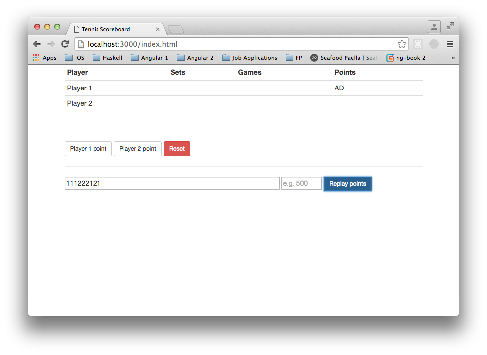

## Description

I plan to re-work my earlier [TennisKataJavaScript](https://github.com/taylorjg/TennisKataJavaScript)
repo as a vehicle for learning/practising the following: 

* [React](https://facebook.github.io/react/)
* Data flow architecture:
    * [redux](http://redux.js.org/)
    * [redux-observable](https://github.com/redux-observable/redux-observable)
    * [rxjs](https://github.com/ReactiveX/rxjs)
* [MongoDB](https://docs.mongodb.com/ecosystem/drivers/node-js/)
* [Node.js](https://nodejs.org) / [Express](http://expressjs.com/)
* [REST APIs](http://stackoverflow.com/questions/671118/what-exactly-is-restful-programming)
* [ECMAScript 2015](https://babeljs.io/docs/learn-es2015/)

## TODO

Following is an outline of what I intend to implement.

### Phase 1

* ~~Very basic UI that can display points for a single game (e.g. 1, 2, 3, etc.)~~
* ~~Add a couple of buttons to manually score points for player 1 / player 2~~
* ~~Show correct game points (e.g. 15, 30, 40 instead of 1, 2, 3)~~ 
* ~~Support the ability to enter a series of points and then click a button to replay them~~
* ~~Use RxJS to replay the points~~
* Use a form to present the replay points feature
* Add form validation
* ~~Add the ability to cancel the replay of points~~
* ~~When points are being replayed, disable all buttons except Cancel~~

#### Screenshot of Phase 1

### Phase 2

* Extend the UI to support games
* Extend the UI to support sets
* Populate MongoDB with archived point-by-point data for a bunch of real matches
* Add REST APIs to make this data available to the client
* Support the ability to choose a match and replay it
* Support the ability to enter the names of the players
* Support the ability to enter the length of the match (3 or 5 sets)

### Phase 3

* Extend the UI to indicate the current server, break points, set points, match points, new balls, etc.
* Add support for theming e.g. Wimbledon theme, Roland Garros theme, etc.
* Add support for searching for a match (by tour, player, date, etc)  

## Links

* Tennis Data
    * [Grand Slam Point-by-Point Data, 2011-15](https://github.com/JeffSackmann/tennis_slam_pointbypoint)
    * [Sequential point-by-point data for tens of thousands of pro matches](https://github.com/JeffSackmann/tennis_pointbypoint)
    * [Live Tennis Scores - Wimbledon 2016, Tennis Livescore, Results, ATP & WTA Rankings](http://www.flashscore.com/tennis/)
        * [Raonic M. vs Murray A. (match summary)](http://www.flashscore.com/match/AaXp0YFB/#match-summary)
        * [Raonic M. vs Murray A. (point by point)](http://www.flashscore.com/match/AaXp0YFB/#point-by-point;1)
* React Examples
    * [react-infinite-calendar](https://github.com/clauderic/react-infinite-calendar)
* React Conventions
    * [Airbnb React/JSX Style Guide](https://github.com/airbnb/javascript/tree/master/react)
    * [File and folder naming convention for React.js components](https://gist.github.com/koistya/d7a507438c741ee6adb5)
* Redux
    * [Redux](http://redux.js.org/)
    * [Usage with React](http://redux.js.org/docs/basics/UsageWithReact.html)
    * [redux-observable](https://github.com/redux-observable/redux-observable)
    * [redux-observable is middleware for redux that is inspired by redux-thunk](https://medium.com/@benlesh/redux-observable-ec0b00d2eb52)
* React / Redux Examples
    * [A Soundcloud client built with React / Redux](https://github.com/andrewngu/sound-redux)
        * https://soundredux.io/
* RxJS 5
    * [rxjs](https://github.com/ReactiveX/rxjs)
    * [RxJS 5 Documentation](http://reactivex.io/rxjs/)
    * [Use RxJS with React](http://michalzalecki.com/use-rxjs-with-react/)
* Miscellaneous
    * [Stage 2 preset · Babel](http://babeljs.io/docs/plugins/preset-stage-2/)
    * [VSCode Linter ES6 ES7 Babel linter](http://stackoverflow.com/questions/36327096/vscode-linter-es6-es7-babel-linter)
    * [Using React with ECMAScript 2015](https://www.jayway.com/2015/03/04/using-react-with-ecmascript-6/)
